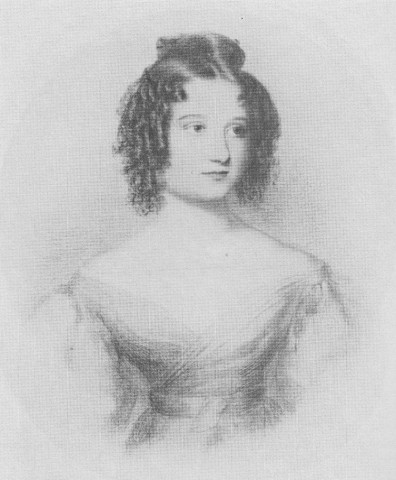

# Распределённая обработка информации и NoSQL базы данных

<!-- © [Высшая инженерная школа «Авалон»](http://www.avalon.ru/) \ -->
<!-- © [ООО «Ланит-Терком»](http://lanit-tercom.com/) \ -->
<!-- © [ФГАОУ ВО СПбПУ](http://spbstu.ru/) \ -->

* © [Дмитрий Луцив](http://dluciv.name/)
* © Ещё кто-то, но пока не совсем понятно, кто именно =)

Лицензия на материалы пока тоже непонятно, какая, но будем считать, что [уже есть](LICENSE.md).

## Аннотация

Этот курс составлен по мотивам программы одноименного [спецсеминара](http://edu.dluciv.name/Home/distrinfproc) для 4 курса (бакалавриат) студентов отделения информатики Матмеха СПбГУ.

В отличие от спецсеминара для студентов, этот курс ориентирован на программистов, которые уже обладают достаточным опытом в практическом программировании и хотят расширить свою эрудицию в актуальных областях.

Курс подразумевает занятия, которые объединяют в себе лекции, семинары и совместные лабораторные работы. От участников ожидается активная обратная связь. Мы будем вместе пробовать рассматривать распределённые вычислительные системы и СУБД, обрабатывать данные, пробовать реализовывать свои вычислительные системы.

## Расписание

### Когда?
По вторникам **с 17:30 до 19:00** (внимание, не с 17:10, а с 17:30). Пока так. *Наверное* и дальше тоже. Длительность курса — 7-8 пар.

### Место встречи изменить можно
Встречаемся у 4337, фактически занятие проводим в помещении, которое способно будет нас вместить. В случае, если нас окажется более двухсот, идём в парк [Сергиевка](https://ru.wikipedia.org/wiki/%D0%A1%D0%B5%D1%80%D0%B3%D0%B8%D0%B5%D0%B2%D0%BA%D0%B0_(%D0%B4%D0%B2%D0%BE%D1%80%D1%86%D0%BE%D0%B2%D0%BE-%D0%BF%D0%B0%D1%80%D0%BA%D0%BE%D0%B2%D1%8B%D0%B9_%D0%B0%D0%BD%D1%81%D0%B0%D0%BC%D0%B1%D0%BB%D1%8C)).

### А если виртуально?
Общения много, но порой хочется ещё больше, и круглосуточно.

[**Сей чат**](https://riot.im/app/#/room/#lt-nosql:matrix.org) как раз на такой случай. *Чат запущен на основе системы [Matrix](http://matrix.org/). Вы можете зарегистрироваться на сервере создателей, а можете [запустить свой](https://github.com/matrix-org/synapse/blob/master/README.rst) — система децентрализованная, подобно Email или XMPP, и разные сервера крепко дружат друг с другом.*

## Программа

Отметим сразу, что в связи с организационной спецификой, некоторые слушатели по ряду тем могут быть более эрудированы и иметь больший практический опыт, нежели преподаватель. В этом случае очень приветствуется как активное участие (которое приветствуется всегда), так и выступление кого-либо из слушателей с докладом на выбранную тему.
Программа [может и, вероятно будет меняться](https://en.wikipedia.org/wiki/Self-modifying_code) по мере исполнения.

Доступны [приветсвтенные слайды](https://dluciv.github.io/nosql-intro-course/slides/00-Hello).

### Проблематика

1. Хочется много
    * Закон Мура — правда, мура́, и где всё-таки правда
    * Закон Амдала
    * Топология задачи и топология вычислителя (пример — станция управления лифтом)
2. Реляционные БД и СУБД
    * Сложность
    * Масштабируемость и доступность
    * Вопросы программной инженерии — таблицы-объекты-таблицы
    * Вопросы *допрограммной* инженерии — вспомним табуляторы

Доступны [запись занятия 25.10.2016](https://youtu.be/qHFYgicOI1o) и [слайды](https://dluciv.github.io/nosql-intro-course/slides/01-Problematics).

### The NoSQL movement и основные свойства NoSQL БД
1. The NoSQL Movement
    * История
    * Суть
2. ACID vs BASE, [О согласованности в конечном счёте](http://citforum.ru/gazeta/154/)
3. Консенсус в распределённых вычислительных системах
4. «Теорема» [CAP](https://en.wikipedia.org/wiki/CAP_theorem)
    * Правда жизни
    * [«Доказательство»](http://mwhittaker.github.io/2014/08/16/illustrated-proof-cap-theorem/)
    * [Дискуссия](http://citforum.ru/gazeta/154/) и [критика](https://arxiv.org/abs/1509.05393)
5. «Теорема» [PACELC](https://en.wikipedia.org/wiki/PACELC_theorem)

Доступны [слайды](https://dluciv.github.io/nosql-intro-course/slides/02-NoSQL_Movement_CAP_PACELC) и [видеозапись занятия 01.11.2016](https://youtu.be/6tAG-OexfQI) (пункты 1..3 и начало 4 программы).

### Нереляционные СУБД
1. Графовые
2. Логические
3. Ключ-значение
4. Документо-ориентированные
    * XML — [Sedna](http://sedna.org/), [eXistdb](http://exist-db.org/exist/apps/homepage/index.html)
    * JSON — [MongoDB](https://www.mongodb.com/), [CouchDB](http://couchdb.apache.org/)
5. Колоночные

### Паттерны и технологии

Паттерны

1. GRID
2. Map-Reduce

Некоторые технологии

1. MPI
2. ФС кластеров

### Распределённая обработка данных
1. Краткий экскурс в выбранную платформу, на выбор:
    * Akka (Scala)
    * Erlang
    * Microsoft Orleans
2. Самостоятельно реализуем GRID
    * Решение одной из предложенных задач методом грубой или не очень грубой силы
3. Самостоятельно реализуем Map-Reduce
    * Простой агрегирующий анализ данных из «диких» источников в сети

### Использование NoSQL СУБД
Простой агрегирующий анализ обработанных данных

На выбор:

* MongoDB 
* CouchDB

### Андеграунд
1. Добросовестность сервисов и лояльность пользователей; совесть — лучший котнролёр; что попало в интернет — остаётся там навсегда
2. ZeroNet, FreeNet, IPFS
3. «Правильные» мессенджеры — XMPP, Matrix, Tox...
4. Blockchain и те, кто из него произошёл
5. Изоляция: две сети в «ящиках»; deaddrops

### Инженерия ПО и процесса производства ПО
Дискуссия

2. [NoSQL и Agile](https://www.mongodb.com/agile-development)
3. [Риски](https://jaxenter.com/nosql-vs-postgres-121967.html)

Решения

1. [Wakanda: NoSQL for Model-Driven Web applications - NoSQL matters 2012](http://www.slideshare.net/alexandre_morgaut/wakanda-nosql-for-modeldriven-web-applications)
2. Продолжение следует

## Список литературы

... и не только литературы

1. Christof Strauch [NoSQL Databases](http://www.christof-strauch.de/nosqldbs.pdf)
2. Michael Stonebraker [Errors in Database Systems, Eventual Consistency, and the CAP Theorem](http://cacm.acm.org/blogs/blog-cacm/83396-errors-in-database-systems-eventual-consistency-and-the-cap-theorem/fulltext#). BLOG@CACM, April 5, 2010.
   [Перевод](http://citforum.ru/gazeta/154/) С.Д. Кузнецова, ИСП РАН
3. Seth Gilbert, Nancy Lynch. [Brewer's Conjecture and the Feasibility of Consistent Available Partition-Tolerant Web Services](http://citeseerx.ist.psu.edu/viewdoc/summary?doi=10.1.1.20.1495). In ACM SIGACT News, 2002
4. Daniel J. Abadi. [Consistency Tradeoffs in Modern Distributed Database System Design](http://cs-www.cs.yale.edu/homes/dna/papers/abadi-pacelc.pdf), Yale University, 2012
5. Ian Robinson, Jim Webber, Emil Eifrem. [Graph Databases](http://graphdatabases.com/), O'Reilly Media, 2013
