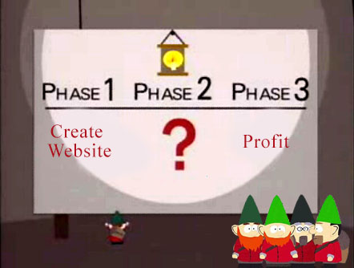

## Распределённая обработка информации и NoSQL СУБД

# Инженерия ПО и процесса производства ПО

### Луцив Дмитрий Вадимович
### ЗАО «Ланит-Терком», СПбГУ

= = = = = = = = = = = = =

<!--.element: style="width: 80%" -->

# I'm glad it has a name...

- - - - - - - - - - - - -
## Agile

* Быстрый фидбэк и минимизация риска
    * Быстрые адаптация к изменяющимся требованиям и оптимизация

- - - - - - - - - - - - -
## MongoDB

[MongoDB is built for agile development](https://www.mongodb.com/agile-development)

*Databases that allow the storage of unstructured data, such as the NoSQL databases, support agile development by freeing developers from upfront and evolving schema specification.*

И только-то... =)

А в чём секрет?

- - - - - - - - - - - - -
## Общий подход

<!-- .element: style="height:500px;" -->

1. Получили откуда-то идею сервиса
2. Наковыряли у пользователей или в своих существующих базах много данных
3. Данные представили в форме, соответствующей идее сервиса
4. Реализовали сервис
5. Пользователям крутим рекламу, с инвесторов требуем больше денег
6. Обязательно тусим на всяких модных выставках и технологических конференциях
7. PROFIT

- - - - - - - - - - - - -
## Немного здравого смысла

<!-- .element: style="height:400px;" -->

1. Современные сервисы действительно часто недолго живут, и иногда очень важны прототипы на выброс
2. Для получения лёгкого цикла развёртывания полезно уметь делать *масштабируемые* сервисы
   на *облачных платформах*, и здесь NoSQL действительно даёт выигрыш
3. [Joe Pasqua, executive vice president of products for MarkLogic](http://www.dbta.com/BigDataQuarterly/Articles/The-Emerging-Agile-Data-Architecture-NoSQL-Hadoop-and-Beyond-113936.aspx):
    * Не забываем про золотой молоток: *“Most of the NoSQL market isn’t focused on mission-critical apps which require really strong security, high availability, disaster recovery, replication modes, deployment modes, and so on. Those features are very hard to implement and take many years to harden. It’s just not the design point for most NoSQL products.”*
    * И без NoSQL итак уже всё плохо: *“We’ve found that organizations hit roadblocks even with the variety of their structured data. They’ve got 20 systems that all have the concept of  a customer and have 20 wildly different schemas. Being able to bring together all of the structured data across all of these schemas and also accommodating unstructured data is giving them a huge advantage.”*

- - - - - - - - - - - - -
## [Ещё немного здравого смысла](http://www.dbta.com/BigDataQuarterly/Articles/The-Emerging-Agile-Data-Architecture-NoSQL-Hadoop-and-Beyond-113936.aspx)

<!-- .element: style="height:300px;" -->

Robin Schumacher, vice  president  of products  for  DataStax:

* *“Once an enterprise transitions from modeling data the RDBMS way to the NoSQL way, success is almost always a given.”*
* Pasqua: *“The first thing to do is develop a solid use case with a clear understanding of what you are trying to accomplish. It’s important to have buy-in on this from the top level and equally important to have the people in place to carry out the project.”*

В итоге: ограничивая операбельность данных, мы вынуждены чётче позиционировать логику и весь продукт

= = = = = = = = = = = = =

# Немного о PostgreSQL <!-- .slide: data-background="images/baby-elephant.gif" -->

В качестве примера, а не общего момента <!-- .element: style="text-align:center;" -->

- - - - - - - - - - - - -
## Если мы не такие ковбои, то...

* NoSQL в подавляющем большинстве случаев касается хранения, а не обработки данных.
* Для каждого приложения — своя база. Хорошо, когда оно одно, или когда подход полностью
  сервисо-центричен, а если нет?..
* Когда сервис уйдёт, а данные останутся, что тогда с ними делать?

[Pierre Fricke, 4.11.2015](https://jaxenter.com/nosql-vs-postgres-121967.html)

Предлагает использовать возможности PostgreSQL для хранения неструктурированных данных и по
интеграции с NoSQL СУБД. Чем это конкретно лучше — не говрит, но *предположительно* это должно
снизить размеры NoSQL-агрегатов.

- - - - - - - - - - - - -
## А теперь то же самое с числами

Jameel Mohammed. [Is Postgres NoSQL Better Than MongoDB?](http://www.aptuz.com/blog/is-postgres-nosql-database-better-than-mongodb/). 24.02.2015

А что с шардингом? Умеет, хотя конечно сложнее, чем в MongoDB.

* Денис Иванов (2ГИС). [Масштабирование базы данных через шардирование и партиционирование](http://highload.guide/blog/scaling-database.html)
* Суровский Евгений. [Очень большой Postgres](https://habrahabr.ru/post/253017/) 13.03.2015

    CREATE TABLE test1
    ( id bigint NOT NULL, profile bigint NOT NULL,
      status integer NOT NULL, switch_date timestamp NOT NULL,
      CONSTRAINT test1_id_pkey PRIMARY KEY (id)
    ) to node (datanode1, datanode2); -- round robin

    CREATE TABLE test2
    ( id bigint NOT NULL, profile bigint NOT NULL,
      status integer NOT NULL, switch_date timestamp NOT NULL,
    CONSTRAINT test2_id_pkey PRIMARY KEY (id)
    ) distribute by REPLICATION;

    CREATE TABLE test3
    ( id bigint NOT NULL, profile bigint NOT NULL,
      status integer NOT NULL, switch_date timestamp NOT NULL,
    CONSTRAINT test3_id_pkey PRIMARY KEY (id)
    )  distribute by HASH(id); -- whole cluster

    CREATE TABLE test4
    ( id bigint NOT NULL,  profile bigint NOT NULL,
      status integer NOT NULL,  switch_date timestamp NOT NULL 
    ) distribute by MODULO(status); -- whole cluster

- - - - - - - - - - - - -
## Мораль

1. Если нужен велосипед, *сперва посмотреть велосипеды*.
2. Всё-таки сперва [позиционировать сервис/приложение](http://highscalability.com/blog/2011/6/20/35-use-cases-for-choosing-your-next-nosql-database.html), а не просто делать «хорошую базу,
   на которую потом можно усадить всё».

= = = = = = = = = = = = =
# Спасибо
