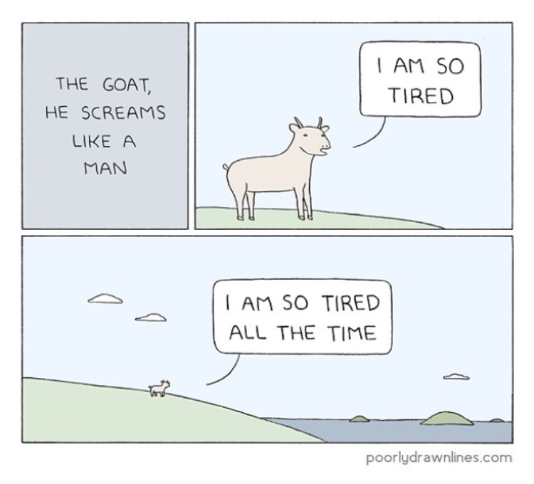

<!-- -*- coding: utf-8 -*- -->

## Семинар кафедры системного программирования

---

# Курс повышения квалификации
# «Распределённая обработка
# информации и NoSQL СУБД»

---

### Луцив Дмитрий Вадимович
### Кафедра системного программирования СПбГУ
### ЗАО «Ланит-Терком»

= = = = = = = = = = = = =

# Как это всё началось?..

<!--.element: style="height:800px;" -->

<!--.slide: style="text-align:center;" -->

- - - - - - - - - - - - -
## Курсы повышения квалификации

<!--.element: style="height:600px;" -->

<!--.slide: style="text-align:center;" -->

- - - - - - - - - - - - -
## Акценты

* Есть слушатели, которые знают конкретные темы лучше
* Много слушателей, у которых в принципе опыт больше
* Не академическая подача материала
  * Уровень слушателей высокий, но занятия поздно, и все к этому времени уже уставшие

<!--.element: style="text-align:center;" -->

= = = = = = = = = = = = =
# Содержание курса

- - - - - - - - - - - - -
## Проблематика

Сложность, масштабируемость и доступность релязионных СУБД
* Законы Мура и Амдала

А также того, что было до реляционных СУБД и параллельно с ними
* Табуляторов
* Иерархических СУБД
* Слабоструктурированных документо-ориентированных СУБД

Вопросы проектирования и архитектуры
* Уместность универсальных популярных методологий
* Топологии задачи и вычислителя

[Слайды](../01-Problematics)

- - - - - - - - - - - - -
## The NoSQL Movement

<!--.element: style="text-align:center;" -->

История и суть

Основы:
* ACID и BASE
* Консенсус в распеределённых системах
  * Этот кусочек фактически повис, из него ничего не следовало<!-- .element: style="color: red;" -->
* Теоремы [CAP](../02-NoSQL_Movement_CAP_PACELC/#/cap-content) и [PACELC](../02-NoSQL_Movement_CAP_PACELC/#/pacelc-pacelc_1)

[Слайды](../02-NoSQL_Movement_CAP_PACELC)

- - - - - - - - - - - - -
## Нереляционные СУБД
1. Графовые
2. Логические
3. Ключ-значение
4. Документо-ориентированные
    * XML — [Sedna](http://sedna.org/), [eXistdb](http://exist-db.org/exist/apps/homepage/index.html)
    * JSON — [MongoDB](https://www.mongodb.com/), [CouchDB](http://couchdb.apache.org/)
5. Колоночные (которые на самом деле обычно реляционные =) )
    * Тут следоввало позвать хорошо разбирающегося коллегу, тем более, что он есть<!-- .element: style="color: red;" -->

[Слайды](../03-NonRelOverview)

- - - - - - - - - - - - -
## Паттерны и технологии

Технологии

2. ФС кластеров

Паттерны

2. Map-Reduce
3. Pregel

[Слайды](../04-Techs_and_Patterns)

- - - - - - - - - - - - -
## Практические примеры

1. Пример использования API MongoDB (JavaScript и LiveScript)
   * Установка и простейшая конфигурация сервера
   * Импорт данных
   * Хранимый код
   * Простая аналитическая задача с использованием MapReduce
2. Самостотельно реализуем GRID
   * На выбор — Akka, Erlang, Microsoft Orleans
   * Распределённый подбор пароля к ZIP-архиву

[Слайды](../05-Distributed_Envs)

- - - - - - - - - - - - -
## Программная инженерия

<!--.element: style="height:600px;" -->

[Слайды](../06-Software_Engineering)

<!--.slide: style="text-align:center;" -->

- - - - - - - - - - - - -
## Андеграунд

Бонусная лекция, актуальность в рамках курса спорна<!-- .element: style="color: red;" -->

1. Добросовестность сервисов и лояльность пользователей; совесть — лучший котнролёр; что попало в интернет — остаётся там навсегда
2. ZeroNet, FreeNet, IPFS
3. «Правильные» мессенджеры — XMPP, Matrix, Tox...
4. Blockchain и те, кто из него произошёл
5. Изоляция: две сети в «ящиках»; deaddrops

[Слайды](../07-Underground)

= = = = = = = = = = = = =
# Ресурсы

- - - - - - - - - - - - -
## Литература и статьи в сети

1.  Christof Strauch [NoSQL Databases](http://www.christof-strauch.de/nosqldbs.pdf)
2.  Michael Stonebraker [Errors in Database Systems, Eventual Consistency, and the CAP Theorem](http://cacm.acm.org/blogs/blog-cacm/83396-errors-in-database-systems-eventual-consistency-and-the-cap-theorem/fulltext#). BLOG@CACM, April 5, 2010.
    [Перевод](http://citforum.ru/gazeta/154/) С.Д. Кузнецова, ИСП РАН
3.  Новиков Б.А., Домбровская Г.Р. Настройка приложений баз данных. БХВ-Петербург, 348 С., 2012. Открыто доступна [развёрнутая аннотация](http://citforum.ru/seminars/cbd2008/2_7.pdf)
4.  Seth Gilbert, Nancy Lynch. [Brewer's Conjecture and the Feasibility of Consistent Available Partition-Tolerant Web Services](http://citeseerx.ist.psu.edu/viewdoc/summary?doi=10.1.1.20.1495). In ACM SIGACT News, 2002
5.  Daniel J. Abadi. [Consistency Tradeoffs in Modern Distributed Database System Design](http://cs-www.cs.yale.edu/homes/dna/papers/abadi-pacelc.pdf), Yale University, 2012
6.  Ian Robinson, Jim Webber, Emil Eifrem. [Graph Databases](http://graphdatabases.com/), O'Reilly Media, 2013
7.  Jeffrey Dean, Sanjay Ghemawat. [MapReduce: Simplified Data Processing on Large Clusters](http://static.googleusercontent.com/media/research.google.com/es/us/archive/mapreduce-osdi04.pdf), [OSDI, 2004](https://www.usenix.org/legacy/event/osdi04/)
8.  Toby Segaran. [Programming Collective Intelligence](http://shop.oreilly.com/product/9780596529321.do), O'Reilly Media, 2007
9.  Grzegorz Malewicz, Matthew H. Austern, Aart J.C Bik, James C. Dehnert, Ilan Horn, Naty Leiser, and Grzegorz Czajkowski. [Pregel: A System for Large-Scale Graph Processing](https://kowshik.github.io/JPregel/pregel_paper.pdf). In Proceedings of the 2010 ACM SIGMOD International Conference on Management of data (SIGMOD '10). ACM, New York, NY, USA, 135-146. DOI=http://dx.doi.org/10.1145/1807167.1807184
10. Fred Hébert. [Learn You Some Erlang for Great Good](http://learnyousomeerlang.com/), 2013
11. Суровский Евгений. [Очень большой Postgres](https://habrahabr.ru/post/253017/), 2015

- - - - - - - - - - - - -
## Прочие

[Страничка курса](https://dluciv.github.io/nosql-intro-course)

[Чат](https://riot.im/app/#/room/#lt-nosql:matrix.org)

= = = = = = = = = = = = =
# Что хотелось бы изменить/улучшить

- - - - - - - - - - - - -
## Вовлечённость слушателей

Трудности

* Тяжело бороться с собой и что-то делать, когда тебя и так бесплатно развлекают =)
  * Особенно вечером
* Много вводной информации, а конкретной — довольно мало
  * $\implies$ Тяжело придумывать задания
  * $\implies$ Было *и есть* не совсем ясно, что делать с оценками

Тем не менее
  * Одно из двух заданий слушатели успешно выполнили
	* Победитель даже получил приз =)
  * Достаточно живо отреагировали на сбои при организации видеозаписи, помогли

- - - - - - - - - - - - -
## Приглашённые специалисты

* Один раз пытался привлечь коллег из Теркома к рассказу по дополнительной теме.
  Не привлеклись.
* *Минимум* один раз стоило попытаться привлечь коллег с Матмеха к рассказу по
  основным темам. Например:
  * Чернышёв Г.А. специализируется на колоночных СУБД

- - - - - - - - - - - - -
## Копирайт

До сих пор не совсем понятно, может ли СПбГПУ пользоваться моими материалами
без меня, а я — без них, и для чего.

= = = = = = = = = = = = =
# Немного про ООО «Ланит-Терком»

Персональное оценочное суждение.

* В компании работает много сотрудников с хорошими образованием и
  бэкграундом вообще.
* Несмотря на большое количество внешних кадров, кадровая политика
  позволяет сохранить академический дух.

Ощущается потенциал для расширения образовательной деятельности.

Судя по моим личным результатам — есть место подвигу, и ещё много.

= = = = = = = = = = = = =

# Спасибо
