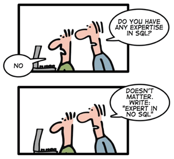

## Семинар кафедры системного программирования

---

# Курс повышения квалификации
# «Распределённая обработка
# информации и NoSQL СУБД»

---

### Луцив Дмитрий Вадимович
### Кафедра системного программирования СПбГУ
### ЗАО «Ланит-Терком»

= = = = = = = = = = = = =

# Как это всё началось?..

<!--.element: style="height:800px;" -->

<!--.slide: style="text-align:center;" -->

- - - - - - - - - - - - -
## Курсы повышения квалификации

= = = = = = = = = = = = =
# Немного про ООО «Ланит-Терком»

Персональное оценочное суждение.

* В компании работает много сотрудников с хорошими образованием и
  бэкграундом вообще.
* Несмотря на большое количество внешних кадров, сохраняется
  определённый академический дух. Видимо хорошая кадровая политика.

$$\implies$$

Есть ощущение, что в принципе подобный вид деятельности допускает
повышение объёма.

= = = = = = = = = = = = =
# Спасибо
